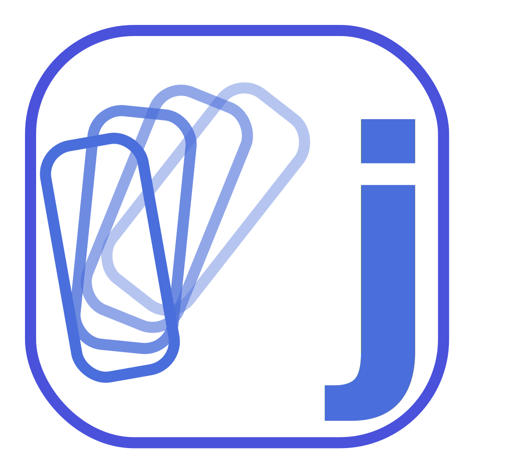

<h1> JunkCleaner</h1>

**Порядок на диске без сюрпризов**  
Аккуратный помощник для Windows. Ничего не удаляет без вашего решения.

---

## 📌 О чём эта программа

Временные файлы, дубликаты, кэш и старый «цифровой шум» имеют привычку накапливаться незаметно.  
**JunkCleaner** — это спокойный проводник в мир ваших данных. Он покажет, где скопилось лишнее, но **решение всегда остаётся за вами**. Приложение не удаляет ничего автоматически — только с вашего согласия.

---

## ✨ Что умеет программа


| Категория               | Что делает                                                                                                               |
| ----------------------- | ------------------------------------------------------------------------------------------------------------------------ |
| 🧠 **Умная очистка**    | Собирает типовой «мусор» (временные папки, кэш браузеров и системы). Есть фильтр по дате — не трогать свежие файлы.      |
| 🗑️ **Корзина**         | Освобождает место, которое уже давно ждёт очистки.                                                                       |
| 🌐 **Сеть в порядке**   | Сброс DNS-кэша в один клик, если интернет начал «тормозить» или открывает не те сайты.                                   |
| 📁 **Крупные файлы**    | Моментально находит, что именно «съедает» гигабайты на диске.                                                            |
| 🔄 **Поиск дубликатов** | Укажите папку — программа покажет одинаковые файлы (фото, документы, музыку).                                            |
| 🧩 **Остатки программ** | Аккуратные подсказки, где могут лежать «следы» уже удалённого софта. *Это эвристика — всегда проверяйте список глазами.* |
| ⬆️ **Обновления**       | Встроенный механизм установки новых версий «как у нормальных программ» — удобно и без лишних танцев.                     |


---

## 🤝 Почему этим удобно делиться с друзьями

> JunkCleaner не пугает красными кнопками и не требует быть системным администратором.  
> Интерфейс стабильный, каждый шаг понятен, а контроль остаётся за вами.  
> Это просто **инструмент для порядка** без лишней драмы и скрытых сценариев.

---

## 📋 Примечание

Актуальный список изменений — в [релизах на GitHub](https://github.com/alekseichmsk/JunkCleaner/releases).

---

📍 JunkCleaner · тихо наводит порядок

---

## Для разработчиков

Стек: Windows, .NET 8, WPF. Репозиторий: `[alekseichmsk/JunkCleaner](https://github.com/alekseichmsk/JunkCleaner)`.

### Сборка и запуск

```powershell
cd JunkCleaner
dotnet build -c Release
dotnet run -c Release
```

### Публикация

Portable (требует установленной среды .NET 8 на ПК пользователя):

```powershell
dotnet publish JunkCleaner\JunkCleaner.csproj -c Release -r win-x64 --self-contained false
```

Самодостаточная сборка (больше размер, **не требует** установленного runtime на этом компьютере):

```powershell
dotnet publish JunkCleaner\JunkCleaner.csproj -c Release -r win-x64 --self-contained true
```

Готовый `JunkCleaner.exe` будет в `JunkCleaner\bin\Release\net8.0-windows\win-x64\publish\`.

#### Окно «You must install or update .NET…» / «Microsoft.NETCore.App 8.0.0»

Так бывает, если вы запускаете **не самодостаточный** `JunkCleaner.exe`, а на ПК **не установлен .NET 8** (у разработчика может быть только SDK 10 — он собирает проект, но не подставляет runtime на другой машине).

**Вариант A — поставить runtime (проще для себя):** скачайте и установите **[Desktop Runtime .NET 8 (x64)](https://dotnet.microsoft.com/download/dotnet/8.0)** (блок «Run desktop apps» → Windows x64). Для WPF этого достаточно вместе с базовым компонентом установщика.

**Вариант B — раздать один `.exe` без установки .NET:** выполните публикацию с `--self-contained true` (команда выше) и переносите всю папку `publish\` (или только `JunkCleaner.exe`, если включите single-file — см. ниже).

Опционально один файл (дольше старт, проще копирование):

```powershell
dotnet publish JunkCleaner\JunkCleaner.csproj -c Release -r win-x64 --self-contained true /p:PublishSingleFile=true
```

### Тесты

```powershell
dotnet test JunkCleaner.sln -c Release
```

### GitHub Releases / автообновление

Автообновление в приложении работает через Velopack и проверяет Releases репозитория `alekseichmsk/JunkCleaner`.

Чтобы выпустить новую Velopack-сборку:

```powershell
git tag v0.1.3
git push origin v0.1.3
```

GitHub Actions публикует Velopack assets:

- `JunkCleaner-win-Setup.exe` — установщик для пользователя.
- `JunkCleaner-Portable.zip` — portable-вариант, если он нужен для ручного запуска.
- `JunkCleaner-*-full.nupkg` и при наличии `JunkCleaner-*-delta.nupkg` — пакеты обновления.
- `releases.win.json` и `RELEASES` — feed-файлы, по которым приложение находит новые версии.

Первый переход с MSIX/AppInstaller на Velopack требует ручной переустановки: удалите MSIX-версию JunkCleaner и установите `JunkCleaner-win-Setup.exe`. После этого вкладка «Обновления» будет скачивать и применять новые версии через Velopack.

Velopack ставит приложение в профиль пользователя, обычно в `%LocalAppData%\JunkCleaner`, и обновляет папку `current` без UAC. Сертификат технически не обязателен, но без code signing certificate Windows SmartScreen может показывать предупреждение о неизвестном издателе.

Release notes для GitHub генерируются автоматически, а Velopack-пакет содержит ссылку на соответствующий GitHub Release.

### Примечания

- Для части категорий (например `Windows\Temp`) может понадобиться запуск от имени администратора.
- Логи: `%LocalAppData%\JunkCleaner\logs\`.

